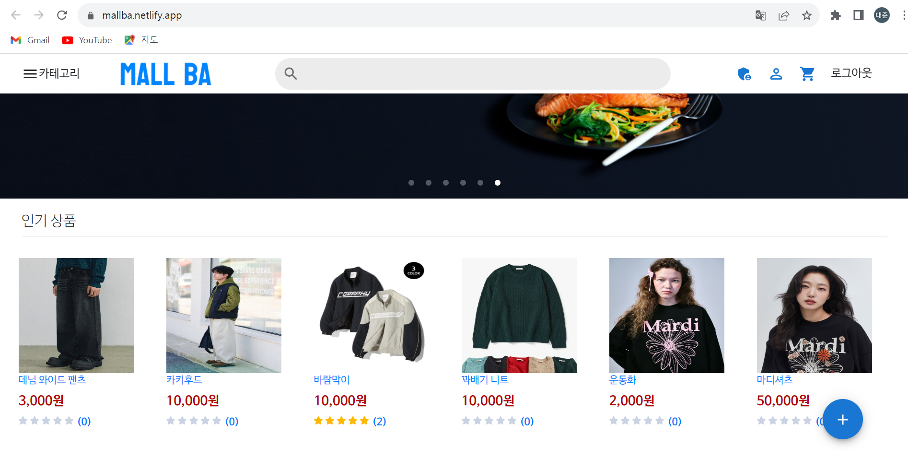

# Web3 쇼핑몰

메타마스크를 활용한 Web3 쇼핑몰 플랫폼입니다.

## 목차

- [프로젝트 소개](#프로젝트-소개)
- [기능 및 특징](#기능-및-특징)
- [실행 방법](#실행-방법)
- [기술 스택](#기술-스택)
- [기여 방법](#기여-방법)
- [라이센스](#라이센스)

## 프로젝트 소개

Web3 쇼핑몰은 블록체인과 스마트 컨트랙트를 활용한 새로운 형태의 쇼핑몰 플랫폼입니다. 사용자는 웹3 지갑을 통해 상품을 구매하고 판매할 수 있습니다.

## 기능 및 특징

- 웹3 지갑 통합
- 스마트 컨트랙트를 이용한 안전한 결제
- 블록체인 기반의 투명한 거래 기록
- 탈중앙화된 상품 리뷰 시스템

## 실행 방법
아래 링크에서 실제 사이트를 사용해 볼 수 있습니다.
[HERE](https://mallba.netlify.app/cart)

## 기술 스택
* Web3.js
* React
* Node.js
* Spring Boot

## 배포 사이트
* netlify